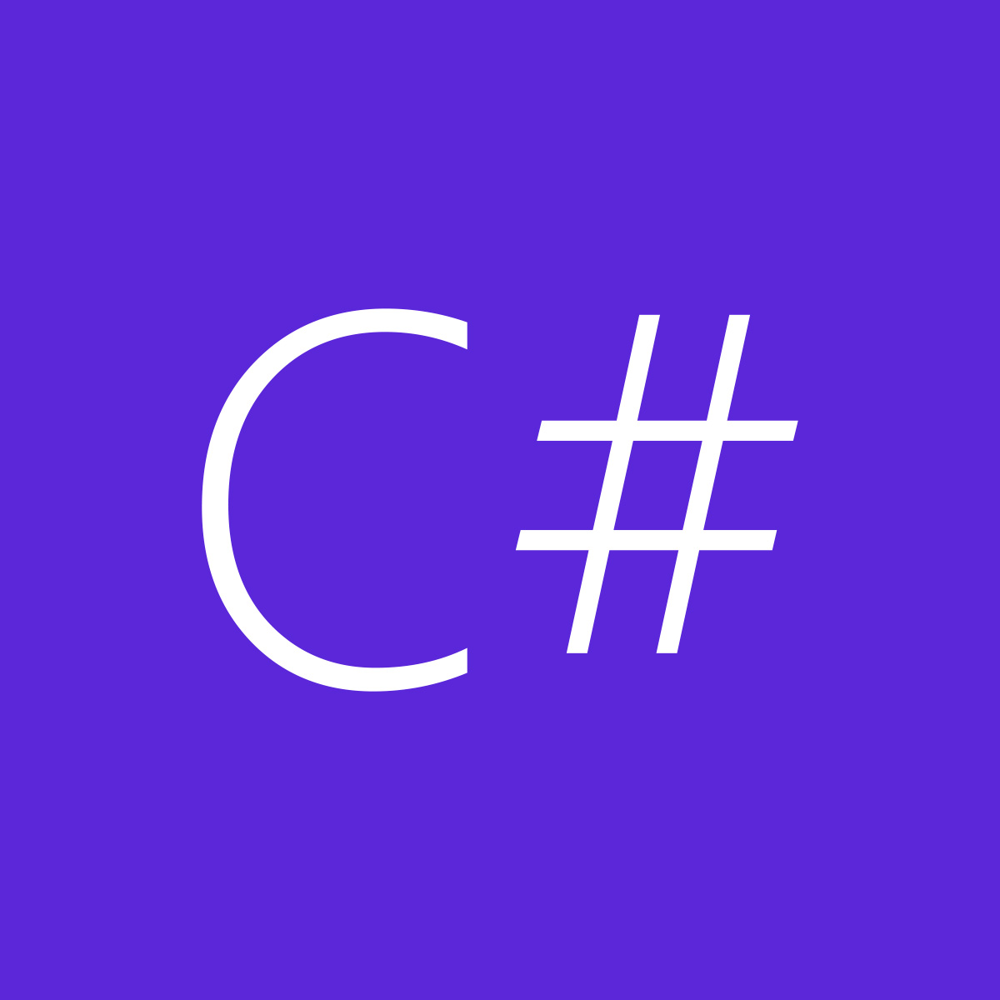
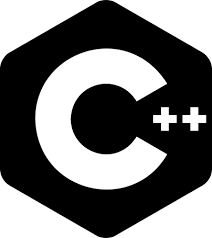

### My name is Braulio Parra 👋
#### Junior back-end developer, Systems Engineering/Computer Science Student, Junior IT Field Engineer and Cybersecurity trainee 👨‍💻.

### Technologies that I know how to use: 
#### -Programming Languajes 👾

 

 

 

 

   [Python, C#, C++, Bash]

#### -Database

 

 [MySQL] 

#### -Other Technologies

 

 [Linux] 

<!---
BR-111/BR-111 is a ✨ special ✨ repository because its `README.md` (this file) appears on your GitHub profile.
You can click the Preview link to take a look at your changes.
--->
